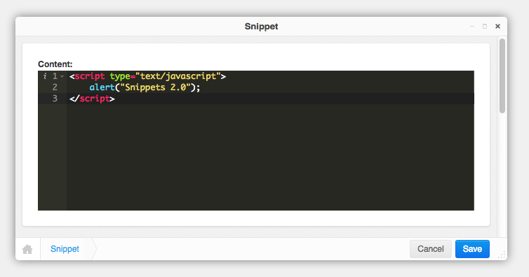

# Aldryn Snippet

Snippets with code editor and syntax highlighting.



## Installation

Install using pip:

```bash
$ pip install aldryn-snippet
```

and add ``aldryn_snippet`` to your ``INSTALLED_APPS``.
Afterwards, sync your database.

## Configuration
* ``ALDRYN_SNIPPET_ACE_THEME``: Custom Editor Theme (i.e. ``ace/theme/solarized_dark``)
* ``ALDRYN_SNIPPET_ACE_MODE``: Custom Editor Mode (i.e. ``ace/mode/html``)


## Migration from djangocms-snippet
You can also use migrate the snippets from ``djangocms-snippet`` to ``aldryn-snippet`` using the following command:

```bash
$ python manage.py migrate_from_djangocms_snippet

# if you want to keep the old snippets in the admin interface use:
$ python manage.py migrate_from_djangocms_snippet --keep
```